# Architecture Diagrams

Visual reference for the system's structural and behavioral design.

---

## 1. High-Level System Overview

```mermaid
graph TB
    subgraph Clients["🌐 Clients"]
        WEB[Web Browser]
        MOB[Mobile App]
        API_CLIENT[API Client / Postman]
    end

    subgraph Docker["🐳 Docker Compose Environment"]
        subgraph App["⚙️ App Container (Node.js / Fastify)"]
            FASTIFY[Fastify Server\n:3000]
            MW[Middleware Layer\nHelmet · CORS · Rate Limit · Auth]
            ROUTER[Route Handlers\n/api/v1/*]
            CTRL[Controllers]
            SVC[Services\nBusiness Logic]
            PRISMA[Prisma ORM Client]
        end

        subgraph DB["🗄️ PostgreSQL Container"]
            PG[(PostgreSQL\n:5432)]
        end
    end

    subgraph External["🔐 Auth Utilities"]
        JWT[JWT\nSign · Verify]
        ARGON[Argon2\nHash · Verify]
    end

    WEB -->|HTTPS / REST| FASTIFY
    MOB -->|HTTPS / REST| FASTIFY
    API_CLIENT -->|HTTPS / REST| FASTIFY

    FASTIFY --> MW
    MW --> ROUTER
    ROUTER --> CTRL
    CTRL --> SVC
    SVC --> PRISMA
    SVC --> JWT
    SVC --> ARGON
    PRISMA --> PG
```

---

## 2. Layered Application Architecture

```mermaid
graph LR
    subgraph Layer1["Layer 1 — Transport"]
        HTTP[HTTP Request]
    end

    subgraph Layer2["Layer 2 — Middleware"]
        HELMET[Helmet\nSecurity Headers]
        CORS[CORS\nOrigin Policy]
        RATE[Rate Limiter\nAbuse Protection]
        AUTH_MW[Auth Middleware\nJWT Verification]
        ROLE_MW[Role Guard\nRBAC Enforcement]
    end

    subgraph Layer3["Layer 3 — Routing"]
        ROUTES[Route Definitions\n/api/v1/auth\n/api/v1/users\n/api/v1/tasks]
    end

    subgraph Layer4["Layer 4 — Controllers"]
        AUTH_CTRL[AuthController]
        USER_CTRL[UserController]
        TASK_CTRL[TaskController]
    end

    subgraph Layer5["Layer 5 — Services"]
        AUTH_SVC[AuthService]
        USER_SVC[UserService]
        TASK_SVC[TaskService]
    end

    subgraph Layer6["Layer 6 — Data Access"]
        PRISMA_CLIENT[Prisma Client\nType-safe Queries]
    end

    subgraph Layer7["Layer 7 — Database"]
        POSTGRES[(PostgreSQL)]
    end

    HTTP --> HELMET --> CORS --> RATE --> AUTH_MW --> ROLE_MW --> ROUTES
    ROUTES --> AUTH_CTRL & USER_CTRL & TASK_CTRL
    AUTH_CTRL --> AUTH_SVC
    USER_CTRL --> USER_SVC
    TASK_CTRL --> TASK_SVC
    AUTH_SVC & USER_SVC & TASK_SVC --> PRISMA_CLIENT
    PRISMA_CLIENT --> POSTGRES
```

---

## 3. Authentication Flow

---

## 4. Authorized Request Flow (RBAC)

---

## 5. Data Model (Entity Relationship)

---

## 6. Docker Infrastructure

---

## 7. Error Handling Flow

---

## 8. Testing Architecture

